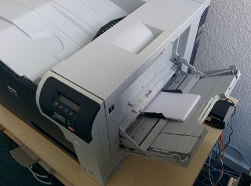
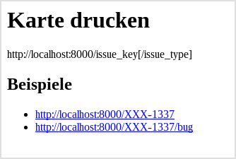
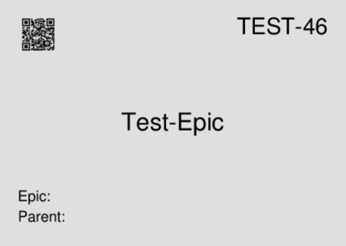
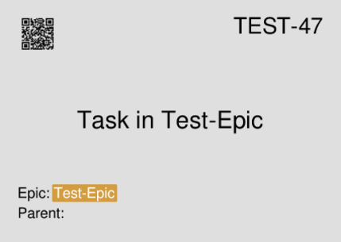
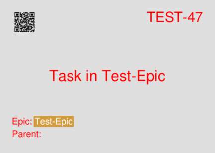
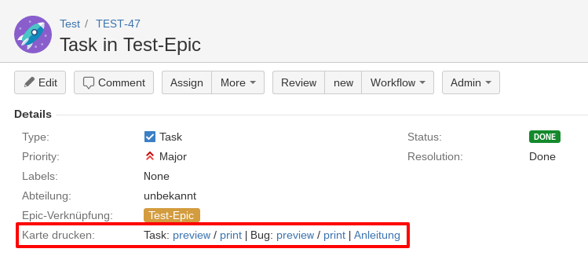

# JIRAcards
(Web)App to print cards from JIRA

## Usage
Create the venv with ./build.sh
### Configuration
Configure the application in conf/live.conf:
```
[jira]
user=<user>
password=<password>
url=https://jira.company.com
epic_custom_field_key=customfield_10655
epic_custom_field_name=customfield_10656
epic_custom_field_color=customfield_10658

[printer]
name=HP_Color_LaserJet_CP5225n
tray=Tray1
```
You need to configure the user, password and URL of your JIRA installation. Unfortunately there is no support for OAuth, yet. Most likely you will want to configure the epic-fields and your printer aswell.
#### Printer configuration
You need to configure your printer with [Cups](https://www.cups.org/) (or whatever printserver you use). Internally JIRAcards calls the command line tool "lp". So you can easily test your printer with the PDFs you find below:
```
lp -d your_printer_name -o media=Tray1 task.pdf
```
We have a printer which has Tray1 as a possibility to feed cards in A6 format. So we specify that here.
[](documentation/printer.jpg)
### Standalone
Simply call the script run.sh with the issue-key to be printed:
```
./run.sh TEST-1
```
Get information on available parameters with --help:
```
./run.sh --help         
usage: main.py [-h] [--type {task,bug}] [--debug] [--mode {preview,print}] key

positional arguments:
  key                    key of JIRA issue

optional arguments:
  -h, --help             show this help message and exit
  --type {task,bug}      type to print
  --debug
  --mode {preview,print} just save or print directly
```
### Webapp
Start the webapp by calling serve.sh. This spins up the application with Gunicorn on it's standard port:
```
./serve.sh
[2016-04-28 13:07:10 +0200] [18721] [INFO] Starting gunicorn 19.4.5
[2016-04-28 13:07:10 +0200] [18721] [INFO] Listening at: http://127.0.0.1:8000 (18721)
[2016-04-28 13:07:10 +0200] [18721] [INFO] Using worker: sync
[2016-04-28 13:07:10 +0200] [18724] [INFO] Booting worker with pid: 18724
```

Calling the web application without a path show a short usage information:



Now you can preview the cards by calling the web application:

* Preview epic TEST-46: http://localhost:8000/TEST-46/task

[](documentation/test_epic.pdf)

* Preview issue TEST-47 as a task card (black color): http://localhost:8000/TEST-47/task

[](documentation/task_in_test_epic.pdf)

* Preview issue TEST-48 as a bug card (red color): http://localhost:8000/TEST-48/bug

[](documentation/bug_in_test_epic.pdf)

If you want to print them, just add /print to the URL. For example: http://localhost:8000/TEST-46/task/print

The QRcode on the cards will take you directly to the issue in JIRA. So just use your tablet when standing in front of your board.

## Integration in JIRA
The easiest way is to call the web interface directly from your JIRA issues. 
We are using the addon [JIRA Misc Custom Fields](https://marketplace.atlassian.com/plugins/com.innovalog.jmcf.jira-misc-custom-fields/server/overview) to add fields that contain clickable links: 


Just add a custom field (we called it "Karte drucken" => "print card") with this description:
```
<!-- @@Formula:
return "Task: <a href='https://jiracards.example.com:8000/" + issue.get("issuekey") + "/task' target='_new'>preview</a> / <a href='https://jiracards.example.com:8000/" + issue.get("issuekey") + "/task/print' target='_new'>print</a> | Bug: <a href='https://jiracards.example.com:8000/" + issue.get("issuekey") + "/bug' target='_new'>preview</a> / <a href='https://jiracards.example.com:8000/" + issue.get("issuekey") + "/bug/print' target='_new'>print</a> | <a href='https://github.com/NorddeutscherRundfunk/jiracards' target='_new'>Anleitung</a>";
-->
```

# TODO
There are still several things I'd like to improve. If you'd like to volunteer, feel free to open a PR!

* allow other formats than A6
* simplify design changes of the cards
* 